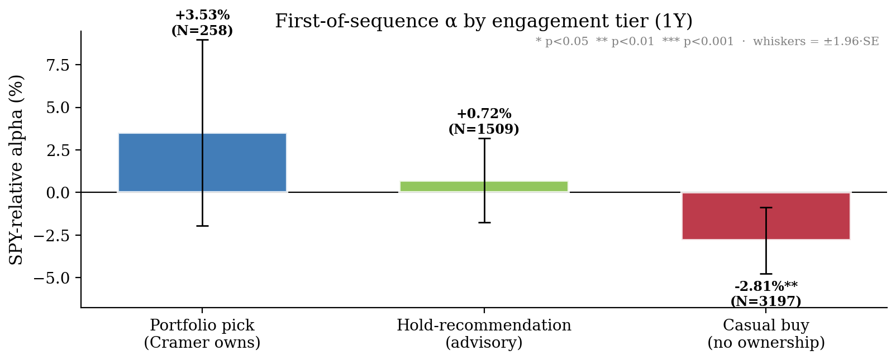

# **What Cramer Holds vs What He Recommends: Signal-Time Features in 16,701 Mad Money Recommendations (2018–2024)**

*Working Paper, April 2026*

**SSRN:** [6643379](https://ssrn.com/abstract=6643379)

**Author:** Andres Kull, PhD
**Affiliation:** Creator, finfluencers.trade
**Email:** andres.a.kull@gmail.com

**JEL classification:** G11, G12, G14, G17, G40.

---

## **Abstract**

We study **16,701** long stock recommendations from Jim Cramer's CNBC *Mad Money* (January 2018 – December 2024) and ask which signal-time features and prior-disclosure states separate the recommendations that subsequently beat the S&P 500 from those that don't. Forward returns are measured at one-, three-, six-, and twelve-month horizons against the same-window return of the SPY ETF. Because Cramer frequently returns to the same names — NVDA alone is recommended 179 times — we first group repeated mentions into 5,459 continuous position sequences, then label each sequence by whether it contains an on-air Charitable Trust ownership disclosure, advisory hold language, or neither.

Four signal-time features and sequence-level labels jointly structure forward performance in the 2018–2024 sample. Market capitalization, trailing 90-day return, and VIX regime are directly observable at recommendation time; engagement tier is used descriptively at the sequence level and operationally only when Cramer has disclosed ownership or hold advice in a prior episode. The sharpest single result is that the casual-buy underperformance is almost entirely a small-cap phenomenon. In the small-cap casual-buy cell, the unconditional one-year stock return is −11.9% versus SPY at +12.7%; outside crisis periods (VIX < 30), the corresponding market-neutral pair trade earns +28.7% per position (p < 0.0001) and remains profitable after typical short-selling costs. Beyond this we show that (i) the engagement-tier ordering *portfolio > hold-recommendation > casual buy* holds directionally and survives controls for size, momentum, and sector, (ii) Cramer's timing on his own Trust holdings is performance-dependent — he is more likely to mention a portfolio name after a recent run-up, and his return mentions on already-owned names *after ≥15% prior drawdowns* predict +24.7% one-year alpha, a pattern that is absent on similarly-drawn-down stocks he does not own, and (iii) the small-cap pair trade flips sign in crisis regimes (VIX ≥ 30), so the regime distinction is essential.

**Keywords:** Jim Cramer; Mad Money; stock recommendations; retail investor attention; recommendation return predictability.

---

## **1. Introduction**

Jim Cramer's *Mad Money* on CNBC is among the most-watched financial television programs in the United States. Each episode contains dozens of stock recommendations — buy calls during monologues, rapid-fire picks in the Lightning Round, and responses to viewer questions. We study **16,701** long recommendations extracted from *Mad Money* broadcasts between January 2018 and December 2024 using an automated pipeline that transcribes episodes and identifies stock-specific directional calls from the transcript text.

Prior work on *Mad Money* has treated Cramer's recommendations as a pooled set and asked whether the average recommendation beats the market. Our question is different and more tractable: **can the viewer, at the moment of recommendation, tell which picks are more likely to work?** The question is tractable because it shifts the statistical burden from aggregate alpha (often drowned in noise) to conditional structure (often detectable in moderate samples), and it maps directly onto what a retail follower of the program actually has to decide when a ticker appears on screen.

Broadcast stock recommendations can move prices quickly; whether they imply testable longer-horizon structure requires large samples, realistic pricing, and dependence-aware statistics. A central challenge in analyzing this dataset is that Cramer frequently returns to the same stocks: NVDA alone is recommended 179 times, with a median gap of just 4 days between mentions. Treating each mention as an independent observation inflates statistical significance. We address this by developing a **signal sequence model** that groups repeated mentions of the same stock into continuous position sequences, then prunes overlapping observations to produce genuinely independent data points (Section 5).

A second challenge lies in the data itself. Our automated extraction pipeline classifies each recommendation as either `start_long` (a new buy call) or `hold_long` (an explicit statement to keep holding). However, the `hold_long` label as extracted by the LLM conflates two very different situations: Cramer stating he *personally owns* a stock in his CNBC Charitable Trust ("own it, don't trade it," "it's in the trust") versus advising a caller to *keep holding* a stock that Cramer himself does not own ("solid hold," "keep holding, terrific management"). Of the ~4,900 `hold_long` signals in the dataset, roughly 1,600 contain explicit ownership language while the remaining ~3,300 are cases where Cramer recommends keeping a stock without indicating he personally owns it. To separate these, we perform a **two-stage reclassification** using the verbatim transcript quotes, producing two distinct sub-types: `cramer_owns` (confirmed personal ownership) and `hold_recommendation` (advisory hold only). This yields three engagement tiers for analysis: **portfolio** sequences (containing at least one confirmed ownership signal), **hold-recommendation** sequences (advisory holds without ownership), and **casual-buy** sequences (first mentions with no subsequent hold signal of any kind).

The paper's central contribution is the identification of four dimensions that jointly structure forward performance in the 2018–2024 sample: **market capitalization**, **prior ownership status / engagement tier**, **trailing 90-day SPY-relative return**, and **VIX regime**. Market capitalization, prior returns, and VIX are directly observable at recommendation time; ownership status is operationally observable only after a prior disclosure and otherwise functions as a descriptive sequence label. We show that these dimensions interact rather than add — the strongest in-sample cell is defined by a specific combination of them, not by any single feature in isolation — and that the aggregate engagement-tier pattern documented in prior Cramer work partially, but not fully, reduces to size and momentum once these features are held constant. Section 6 reports magnitudes, signs, and significance for each feature; Section 9 summarises which combinations were strongest and which were sign-dependent on the regime.

Alongside the four features, we document a separate but directly measurable fact about Cramer's broadcast behaviour: his recommendations on his own Charitable Trust holdings are performance-dependent. He mentions owned names more often after positive short-horizon returns — he promotes his winners. This is measurable for the first time in this dataset and sharpens the interpretation of the engagement-tier pattern, because it means part of any "portfolio-tier alpha" reflects selective promotion of already-rising stocks rather than pure stock-selection skill.

The directly observable features, plus prior disclosed ownership status, could in principle form the basis of a forward-tracked scorecard.

**Section 2** reviews related literature. **Sections 3–4** describe methodology (including the hold reclassification pipeline) and sample features. **Section 5** presents the sequence model and (in §5.7–§5.8) the terminology and in-sample scope statement that govern the results. **Section 6** reports the four signal-time features. **Section 7** examines conditional structure and robustness. **Section 8** lists limitations; **Section 9** concludes.

### **1.1. Research Hypotheses**

We use the term **"first recommendation"** (or "sequence entry") to denote the first mention of a stock that starts a new position sequence — the point at which a viewer following Cramer would initiate a position. All performance is measured as the return above or below the S&P 500 (SPY) over the same period, which we refer to as **SPY-relative alpha** or simply **alpha**.

The hypotheses below state directions; the specific numerical thresholds inside them (the <$2B cutoff in H1, the VIX ≥ 30 cutoff in H4, the drawdown thresholds reported in §6.4b) are descriptive of the 2018–2024 sample, not pre-registered, and are reported alongside a full threshold sweep in §6.2 (Table 8a). The in-sample-only scope statement that governs every numerical claim is in §5.8.

- **H1 (Size predicts casual-buy outcomes)**: Cramer's casual buys on small-cap stocks (<$2B market capitalization at signal time) generate significantly negative one-year alpha. Casual buys on mega-cap stocks do not — indeed, they are directionally positive. A market-neutral pair trade (short stock + long SPY) on the small-cap casual-buy cell, restricted to VIX < 30 regimes, generates positive alpha at conventional significance in the 2018–2024 sample.

- **H2 (The three-tier engagement pattern persists after controls)**: After separately controlling for stock size, prior 90-day price momentum, and GICS sector, the three-tier engagement pattern — portfolio > hold-recommendation > casual buy — holds directionally. No single competing explanation absorbs the pattern, although the portfolio-tier point estimate is underpowered at the available sample size.

- **H3 (Cramer's recommendation timing is performance-dependent, and dip-buys on owned names are a distinct signal)**: Cramer mentions his Charitable Trust holdings more frequently after positive trailing returns. His recommendations on portfolio stocks made after 90-day drawdowns produce forward alpha that rises monotonically with drawdown depth, and at the deepest threshold materially exceeds the baseline portfolio alpha and is sharply separated from the corresponding casual-buy result.

- **H4 (VIX acts as a regime switch for the small-cap casual-buy trade)**: The sign of the small-cap casual-buy cell flips in High VIX (VIX ≥ 30). The inverse trade of H1 is profitable in Low and Moderate VIX and costly during crises; VIX functions as an operational kill-switch rather than as a standalone alpha source.

### **1.2. Contributions**

This paper makes six contributions:

1. **Signal sequence model**: We introduce a framework that organizes broadcast recommendations into continuous position sequences and prunes redundant observations to produce genuinely independent data points for statistical testing, while preserving the information content of repeated mentions.
2. **Hold signal reclassification**: The automated extraction pipeline's `hold_long` label captures both personal ownership and advisory holds indiscriminately. We distinguish between these through LLM-based reclassification of 4,900 signals using verbatim transcript evidence, reducing the portfolio label from 770 tickers to 225 — consistent with the known size of Cramer's Charitable Trust.
3. **Scale and recency**: We analyze 16,701 signals — an order of magnitude larger than prior Cramer studies — covering a period that includes the COVID crisis, meme-stock mania, rate-hike correction, and AI-driven rally.
4. **Size decomposition of the casual-buy result**: We show that the aggregate casual-buy underperformance documented in prior work is not a property of the label itself but is localised to a specific size cell. We separate the market-neutral pair-trade expression of this result from the standalone short expression, because the two differ materially in sign across VIX regimes and have been routinely conflated in the popular "inverse Cramer" framing.
5. **Robustness of the engagement pattern to competing explanations**: We test the portfolio > hold-recommendation > casual-buy ordering against separate controls for size, prior momentum, and sector, and report which parts of the ordering survive each control and which do not. We also flag where the portfolio-tier point estimate remains underpowered at the available sample size.
6. **Empirical measurement of Cramer's recommendation timing**: Prior literature has speculated that Cramer's promotion of his own holdings may be performance-dependent; the hold-reclassification step in this paper makes that hypothesis testable for the first time on a transcript-derived dataset, and we document both the promotion effect and a contrast between dip-buys on owned names and dip-buys on casual names.


```{=latex}
\clearpage
```

## **2. Related Work**

### **2.1. Media, Attention, and Asset Prices**

Financial television sits at the intersection of **attention**, **liquidity**, and **narrative**. Tetlock (2007) linked media tone to return predictability and reversion. Fang and Peress (2009) found that stocks with little coverage can earn different returns than heavily covered names. Barber and Odean (2008) showed that retail investors disproportionately buy attention-grabbing stocks — often the same names featured on programs such as *Mad Money* — with mixed longer-run performance. The launch and liquidation of the Tuttle Capital "Inverse Cramer" ETF (SJIM) in 2023 illustrates that narratives about his performance can themselves attract capital.

Two strands of this literature bear directly on our size-decomposition result in Section 6.2. First, attention-induced price pressure interacts with liquidity: Amihud (2002) documents that illiquid stocks have larger price responses to order flow, and Corwin and Schultz (2012) show that bid-ask spreads widen disproportionately on information events in small-cap names. A broadcast mention that routes even modest retail order flow into a thinly-traded stock can move the price materially at the open; the position then reverts as the attention dissipates. Second, post-publication reversal is a well-established feature of tipsheet and broadcast recommendations. Barber and Loeffler (1993) found reversal in Wall Street Journal "Dartboard" picks attributable to retail-driven price pressure, and Desai and Jain (1995) documented similar dynamics in published buy lists. Our small-cap casual-buy cell is economically consistent with this literature; our mega-cap cell's positive alpha is consistent with the same forces operating too weakly to matter in highly-liquid names.

### **2.2. Analyst Recommendations and "Celebrity" Analysts**

The analyst literature is surveyed by Ramnath, Rock, and Shane (2008). Womack (1996) documented post-announcement drift around recommendation changes. Work on television and celebrity analysts emphasizes short-horizon price impact: Bolster and Trahan (2009) found that media prominence amplifies short-term effects without clear long-horizon superiority; Lim and Rosario (2010) documented transient price moves around CNBC-style appearances.

### **2.3. Market Efficiency and Regime Dependence**

The efficient market hypothesis (Fama, 1970) suggests that public recommendations should not offer persistent alpha. Grossman and Stiglitz (1980) noted the tension between information production and full efficiency. Conditional patterns in our data are consistent with time-varying information and participation (adaptive markets; Lo, 2004) — but statistical association is not proof of a tradable structural edge.

### **2.4. Prior Studies of Jim Cramer and *Mad Money***

Engelberg, Sasseville, and Williams (2012) studied roughly 1,400 initial *Mad Money* recommendations (2005–2009). They found large overnight returns that reversed within weeks — consistent with attention and liquidity rather than long-horizon information. Hartley and Olson (2018) extended through 2014 and found no convincing one-month alpha. Dakken (2017) focused on Lightning Round picks. Neumann and Kenny (2007) documented post-recommendation price dynamics consistent with attention-driven pressure.

**Gap.** Prior Cramer work: (a) uses smaller samples and one or two horizons; (b) does not distinguish between new recommendations and confirmed holdings; (c) does not address the severe within-ticker dependence from repeated mentions. We contribute all three.

---

## **3. Data and Methodology**

### **3.1. Signal Extraction**

Signals are extracted from *Mad Money* podcast transcripts using an automated pipeline. The process has two stages:

1. **Transcription and speaker attribution**: Broadcast audio is transcribed using commercial speech-to-text services. A large language model then performs speaker attribution — mapping anonymous speaker IDs to named individuals (Jim Cramer, guest analysts, callers) based on contextual cues.
2. **Facts extraction**: A second LLM pass identifies stock-specific directional recommendations, classifying each as `start_long` (new buy recommendation), `hold_long` (explicit "I hold this / still like this" statement), or directional signals in the opposite direction. Each signal is annotated with the show segment it appeared in, and the verbatim transcript quote(s) that triggered the classification are stored as the primary evidence for that classification.

The dataset comprises Cramer's long-side recommendations: 11,794 unique `start_long` signal IDs and 4,907 unique `hold_long` signal IDs. For the hold-state reclassification step below, same-day duplicate hold records collapse to 4,900 deduplicated `hold_long` classification inputs.

Downstream performance work keys instruments by **persistent identifiers** (e.g., FIGI) where available, so prices align with the economic entity rather than a possibly recycled ticker symbol.

### **3.2. Hold Signal Reclassification**

The `hold_long` label, as extracted by the initial LLM pass, captures two semantically distinct situations under a single label. Some `hold_long` signals reflect Cramer stating he *personally owns* a stock in his CNBC Charitable Trust ("own it, don't trade it," "it's in the trust," "we added to our position"). Others reflect general advice to callers who already hold a stock ("solid hold," "keep holding," "terrific management"). The distinction matters for our analysis: 770 unique tickers carried at least one `hold_long` label, while Cramer's Charitable Trust typically holds only 25–35 positions at any given time.

To resolve this, we performed a **second-stage LLM reclassification** of all 4,900 unique `hold_long` signals. The classifier received the verbatim transcript quote as its primary input, along with the ticker, date, and show segment. Each signal was classified into one of two sub-types:

- **`cramer_owns`** — Cramer states or clearly implies personal or trust ownership. Indicators include explicit language ("I own," "we hold in the trust," "charitable trust position," "investing club"), actions on his position ("trimmed our stake," "added to our position"), and his signature catchphrase for personal holdings ("own it, don't trade it").
- **`hold_recommendation`** — Cramer advises holding but does not indicate personal ownership. Indicators include advisory language ("solid hold," "keep holding," "stay with it"), quality assessments ("terrific management," "best in class"), and responses to caller questions about whether to sell.

The classifier was instructed to **default to `hold_recommendation` when ambiguous**, prioritizing precision on the `cramer_owns` label over recall. This design choice ensures that the portfolio signal is not diluted by false positives.

The reclassification produced **1,612** `cramer_owns` signals across **225** unique tickers and **3,288** `hold_recommendation` signals. The 225-ticker portfolio count is consistent with seven years of Charitable Trust turnover from a ~30-position portfolio. Cross-referencing against 48 known Trust holdings confirmed that 45 (94%) have `cramer_owns` signals in our data, with the three misses being minor or short-lived positions.

### **3.3. Entry Price: The T+1 Open Rule**

The entry price is standardized to the **market open on the next trading day** following the broadcast. Since *Mad Money* airs at 6 PM EST (after market close), this represents the first price at which a viewer could realistically execute a trade. Any overnight or opening-bell pop driven by the broadcast therefore sits outside the return we attribute to the follower — consistent with treating short-run "Cramer bounce" as liquidity and attention rather than as part of a T+1 investor's edge. This approach matches the "day after" framing in Engelberg et al. (2012).

### **3.4. Position Boundaries**

Positions are closed when (i) Cramer issues an explicit close signal, (ii) he reverses direction on the same instrument, or (iii) the performance horizon end date is reached (natural expiry of the 1W, 1M, 3M, 6M, or 1Y window from entry). If a position ends before the horizon date because of (i) or (ii), longer horizons are discarded.

### **3.5. Benchmarking**

All returns are evaluated against both the S&P 500 (SPY) and Nasdaq-100 (QQQ). As Section 4 will show, Cramer's signal universe is heavily concentrated in Technology stocks, making dual benchmarking essential to separate genuine stock selection alpha from sector beta. We report index-relative returns rather than Fama-French (1993) factor-adjusted alpha because the operational question — whether a viewer who buys at the next open beats a passive SPY allocation — is naturally posed against an investable benchmark, and the index-relative framing remains interpretable when the unit of analysis is a single trade rather than a portfolio.

### **3.6. Transaction Cost Model**

We model transaction costs using Interactive Brokers' (IBKR) Fixed pricing plan: $0.005 per share with a $1.00 minimum per order. For typical retail-size positions, the minimum dominates — a $1,000 allocation incurs approximately $2.00 per round trip (0.20%). Cost impact scales inversely with position size and inversely with horizon length: a 1-week strategy at $500 positions faces ~20% annualized drag, while a 1-year strategy at $5,000 positions faces ~0.05%.

### **3.7. Statistical Framework**

We employ four complementary statistical standards:

**P-values** measure the probability that an observed result could have occurred by chance alone. We use the conventional threshold of p < 0.05 (95% confidence).

**Benjamini-Hochberg (B-H) correction** addresses the multiple testing problem. When testing 45 combinations (5 horizons × 3 VIX regimes × 3 show segments), the probability of finding at least one spurious "significant" result increases rapidly. The B-H procedure controls the False Discovery Rate (FDR), ensuring that among all results we call "significant," no more than 5% are expected to be false positives. This is standard in academic finance (Harvey, Liu, and Zhu, 2016).

**Signal pruning** (Section 5) addresses within-ticker dependence by producing genuinely independent observations. Signals are organized into sequences representing continuous Cramer positions on the same stock, and redundant within-sequence signals — those too close in time and price to represent new information — are removed. The reader can directly inspect which signals contribute to each test.

**Cluster-robust standard errors.** Two forward-return observations on the same ticker — for example, two separate Cramer mentions of NVDA, which appears in 18 sequences in our sample — share most of their underlying daily returns and load on the same idiosyncratic news, so they are not statistically independent. Tables 4, 6, 7, 8 in §6, the Benjamini-Hochberg counts in §7.1, and the shading in Figure 11 — report **one-way ticker-clustered standard errors** following Petersen (2009): OLS of the per-position alpha on a constant with **ticker** as the cluster dimension, tested at G−1 degrees of freedom. The aggregate casual-buy cell in §6.1 is additionally reported under **two-way clustering by ticker × signal-month** to absorb residual cross-ticker correlation within the same month. The promotion-effect test in §6.4a (Table 12) compares two daily-frequency rolling-window means within the same panel of tickers and is reported under (i) a panel regression with ticker fixed effects and one-way ticker-clustered SEs and (ii) a non-parametric ticker-block bootstrap, both of which absorb the within-ticker autocorrelation of overlapping 30-day windows. Table 5 and the secondary tables in §6.3–§6.4 use iid p-values.

---

## **4. Data Overview: What Does Cramer Actually Recommend?**

Before evaluating performance, we summarize descriptive features of the recommendations.

**Signal dates vs. performance measurement window.** Recommendations span January 2018 through December 2024. Long horizons (e.g., one year) extend into 2025 for late-2024 signals.

### **4.1. Signal Volume and Composition**

Over the 2018–2024 window, we extracted 16,701 unique long-side signal IDs from *Mad Money* broadcasts. The signal-horizon panel contains 78,594 rows because not every signal has all five requested horizons available after position-boundary filtering; the effective N varies by horizon as horizons extending beyond a close, reversal, or data-freeze boundary are discarded.

**Table 1:** Signal volume and composition by signal type, show segment, and VIX regime (2018–2024).

| Dimension | Category | Signal Count | Share |
| :--- | :--- | :--- | :--- |
| **Signal Type** | Initiating (`start_long`) | 11,794 | 70.6% |
| | Ownership hold (`cramer_owns`) | 1,612 | 9.7% |
| | Advisory hold (`hold_recommendation`) | 3,288 | 19.7% |
| **Show Segment** | Monologue / Top of Show | 5,554 | 33.3% |
| | Lightning Round | 4,199 | 25.1% |
| | Mid-Show / Interview | 4,712 | 28.2% |
| | Other / Unclassified | 2,236 | 13.4% |
| **VIX Regime** | Low (VIX < 20) | 10,569 | 63.3% |
| | Moderate (VIX 20-30) | 4,772 | 28.6% |
| | High (VIX ≥ 30) | 1,360 | 8.1% |

The two hold subtypes count the 4,900 deduplicated `hold_long` signals with a resolved reclassification; seven raw `hold_long` signal IDs have no resolved subtype after deduplication.

### **4.2. Sector Concentration**

Cramer's sector allocation reveals a strong and persistent Technology overweight:

**Table 2:** GICS-sector composition and mean three-month SPY-relative alpha across all signals.

| GICS Sector | Signals (3M) | Share | Mean SPY Alpha |
| :--- | :--- | :--- | :--- |
| Technology | 3,556 | 23% | +3.5% |
| Consumer Cyclical | 3,211 | 20% | +0.5% |
| Healthcare | 1,784 | 11% | −1.5% |
| Industrials | 1,625 | 10% | −1.4% |
| Consumer Defensive | 1,310 | 8% | −0.5% |
| Communication Services | 1,213 | 8% | 0.0% |
| Financial Services | 1,188 | 8% | −0.3% |
| Energy | 720 | 5% | −2.4% |
| Basic Materials | 537 | 3% | −2.5% |
| Real Estate | 338 | 2% | −2.5% |
| Utilities | 266 | 2% | −1.2% |

Only Technology and Consumer Cyclical show positive mean SPY alpha at the three-month horizon. Most non-Technology sectors are negative, in some cases sharply. What looks like a general "stock picker" track record partly reflects thematic alignment with growth- and tech-heavy segments that happened to work in this macro window.

### **4.3. Stock-Level Concentration**

The top 15 tickers by cumulative alpha contribution account for roughly 4× the total positive alpha across all tickers. This extreme concentration confirms that Cramer's aggregate performance is driven by a small number of outsized Technology winners, particularly NVDA, AAPL, and high-growth names. The Gini coefficient on 3-month SPY alpha is 0.90 — the bottom 60% of tickers collectively contribute near-zero.

### **4.4. The Dependence Problem**

This concentration creates a severe statistical challenge. NVDA contributes 179 observations at the 1-year horizon, with a median inter-signal gap of 4 days. The 1-year return windows of consecutive NVDA signals overlap by ~98%. Treating each as an independent observation would inflate the effective sample size and overstate significance.

We address this by organizing signals into sequences and pruning redundant observations, producing a dataset of genuinely independent data points (Section 5).

---

## **5. The Signal Sequence Model**

### **5.1. Motivation**

The intuition behind the sequence model is straightforward: when Cramer mentions the same stock repeatedly over several weeks, a viewer following his advice would treat this as one continuous position, not a series of separate trades. If Cramer discusses NVDA on January 1, January 5, and January 12 — all as buy recommendations — these are not three independent investment decisions. They are one position with repeated affirmation. Treating them as independent observations would inflate the dataset and overstate statistical significance.

Conversely, when Cramer later confirms NVDA as a personal holding in his Charitable Trust, that represents a meaningful escalation — from casual recommendation to portfolio conviction. The sequence model captures both structures: it groups related mentions into continuous position chains, identifies key transition points (such as the first ownership confirmation), and prunes redundant observations while preserving the signals that carry new information.

### **5.2. Sequence Detection**

Signals on the same ticker in the same direction are grouped into **sequences** — continuous chains of mentions representing a single Cramer position. A new sequence starts when:

1. **Gap expiration**: The time gap from the previous signal exceeds a threshold. We use two thresholds: **120 days** for sequences that contain a hold confirmation (reflecting longer-term portfolio positions), and **60 days** for sequences without a hold (reflecting more transient interest).
2. **Direction reversal**: A signal in the opposite direction appears (e.g., `start_short` terminates a long sequence).
3. **Close signal**: An explicit position close is issued.

The key question in defining a sequence boundary is: how long a silence before we conclude Cramer has lost interest and moved on? The answer reasonably differs by conviction level. When Cramer personally holds a stock in his Charitable Trust, he tends to return to it for months or years — so a 120-day gap without a recommendation is consistent with still being in the position. When he has no personal stake, a 60-day gap more plausibly signals the end of interest. Only `cramer_owns` signals activate the extended 120-day window; an advisory "keep holding" recommendation does not indicate personal ownership and therefore does not justify the longer gap threshold.

### **5.3. Hold-State Propagation**

Within each sequence, the first `cramer_owns` signal triggers a state change: all subsequent signals in that sequence are classified as being in **hold state**, regardless of their original label. Once Cramer confirms a position as a personal Charitable Trust holding, subsequent mentions of the same stock are implicit reaffirmations of the holding — not new independent recommendations. Only explicit ownership language, as identified in the reclassification step (Section 3.2), activates this propagation; `hold_recommendation` signals do not.

Each sequence has at most one "first ownership confirmation" event. The date of this event marks the transition from casual recommendation to confirmed portfolio holding.

### **5.4. Signal Pruning**

Within each sequence, we prune signals that are redundant — too close in time and price to the last retained signal to represent new information. The pruning rules:

- **Sequence starts**: Always kept (the entry signal for each sequence).
- **First hold signals**: Always kept (the transition from recommendation to holding).
- **All others**: Kept only if either (a) more than 60 days have elapsed since the last kept signal, or (b) the price has diverged by more than 10% from the last kept signal's entry price.

This reduces NVDA from 179 raw signals to approximately 38 independent observations while preserving the key structural events (sequence entries and hold confirmations). **Figure 1** walks through the same end-to-end pipeline for Visa (V) — raw LLM classifications, sequence boundaries with hold-state propagation, and the pruned signals kept for statistical testing. Section 5.5 reports sample-wide implementation counts (Table 3).


### **5.5. Implementation Results**

Applying the sequence model with reclassified hold signals:

**Table 3:** Sequence-model implementation results — sequences, signals, and tickers by engagement tier.

| Metric | Value |
| :--- | :--- |
| Total sequences | 5,459 |
| Portfolio sequences (cramer_owns) | 301 (5.5%) |
| Hold-recommendation sequences | 1,691 (31.0%) |
| Casual-buy sequences (no-hold) | 3,467 (63.5%) |
| Raw unique signals | 16,701 |
| Kept after pruning (1Y) | 8,169 of 14,050 (58.1%) |
| In hold state (cramer_owns only) | 4,169 of 14,050 (29.7%) |
| Portfolio tickers | 225 |
| Hold-rec tickers | 718 |
| Casual-buy tickers | 1,250 |

The portfolio tier (301 sequences, 225 tickers) is consistent with seven years of a ~30-position Charitable Trust with periodic turnover. The casual-buy majority (63.5%) reflects the large number of stocks Cramer recommends once or twice without any subsequent hold commitment.

**Bridge to §6 sample sizes.** Section 6 evaluates each sequence at its **first recommendation** — the opening signal of each position sequence, as defined in Section 5 — at the **1-year horizon**. Of the 5,459 sequences in Table 3, **4,964** have a usable 1Y forward observation — split as 258 portfolio + 1,509 hold-recommendation + 3,197 casual-buy, the headline counts that anchor Tables 4–8a. The 495-sequence gap is sequences whose first recommendation lands in the final ~12 months of the sample, where the 1Y horizon does not yet close at the data-freeze date; nothing is dropped by the kept-pruning rule, since by construction a sequence's first signal is never pruned.

### **5.6. Parameter Sensitivity**

The sequence model has four parameters: hold_window (120 days), non_hold_window (60 days), prune_gap (60 days), and prune_price (10%). Section 7.2 reports a full sensitivity analysis across 17 parameter combinations, confirming that all key findings are stable.

### **5.7. Terminology**

Throughout the results sections we use three engagement-tier labels. In first-recommendation tables, these labels are descriptive sequence labels and can depend on ownership or hold statements Cramer makes later in the same sequence. In viewer-actionable applications, the label is observable only when Cramer has already disclosed ownership or hold advice in a prior episode:

- **Portfolio pick** — a recommendation within a sequence in which Cramer has, at some point, publicly confirmed the stock as a Charitable Trust holding; operationally, this is viewer-observable only after a prior ownership disclosure
- **Hold-recommendation pick** — a recommendation within a sequence where Cramer has advised "keep holding" without ever confirming personal ownership; operationally, this is viewer-observable only after prior hold advice
- **Casual buy** — a recommendation within a sequence that contains no ownership confirmation and no hold advice of any kind

We use **engagement tier** (or *tier* where context makes the reference obvious) for this three-way classification. We use "casual buy" in place of the more operational label "no-hold" used in the sequence model, because "casual buy" describes what the signal *is* (a first mention without sustained commitment) rather than what it *isn't*. The label corresponds one-to-one to the **no-hold** tier in that model; the rename is purely narrative.

The portfolio label attaches to a continuous-recommendation sequence, not to the ticker forever. A sequence ends when Cramer explicitly closes the position or goes silent on the ticker beyond the hold-continuity window — 120 days for sequences that contain an ownership confirmation, 60 days otherwise (see Section 5 for the full rules). The sequence model also terminates sequences on direction reversal (e.g., a `start_short` after a long sequence), but this study is restricted to long-side signals, so reversal never fires in the data we analyse. After a sequence ends, the next mention starts a fresh sequence whose tier is re-derived from scratch. Because our dataset contains only on-air disclosures, unannounced exits inside the 120-day window remain labelled as portfolio until the window closes; this is discussed in Section 8.

"Size bucket" refers to a stock's market capitalization at signal time, classified as Mega-cap (>$200B), Large-cap ($10–200B), Mid-cap ($2–10B), or Small-cap (<$2B). Size is measured at the time of the first recommendation in the sequence using current-day market-cap data (see Section 3); this introduces a mild look-ahead component for stocks whose capitalization changed materially between signal date and present, which we discuss in Limitations.

"VIX regime" uses the CBOE Volatility Index (VIX) at the signal date, discretized as Low (<20), Moderate (20–30), or High (≥30). Low and Moderate correspond to ordinary market conditions; High typically corresponds to stress or crisis episodes.

"90-day lookback" refers to the stock's price action over the 90 calendar days preceding the signal date. We measure it two ways. The **absolute** 90-day return matches the behavioral meaning of "dip" — the falling price chart a viewer sees — and is the primary axis for the dip-buy result in §6.4b because it produces the tighter p-values and the cleaner behavioral interpretation. The **SPY-relative** 90-day return (stock minus SPY over the same window) is the same axis re-expressed in market-relative units, used in Section 6.3 to keep the within-bucket engagement-tier comparison in the same units as forward alpha, and reported in §6.4b as a cross-check. The two measures correlate at ρ = 0.92 on the portfolio cell, so the choice of axis shifts magnitudes slightly but does not change the shape of any result.

"Pair trade" refers to a market-neutral dollar-matched long-short position (short the subject stock, long SPY) held for the specified horizon. Per-position P&L is the SPY return minus the stock return over the same horizon (Section 6.2).

**First recommendation** is the opening signal of a position sequence — the point at which a viewer following Cramer would initiate a position (Table 3, bridge to Section 6).

**Sequence model** is the construction in Sections 5.2–5.4 that groups repeated same-ticker mentions into continuous *sequences* and prunes redundant signals, so that e.g. eighteen mentions of a name in a year are not treated as eighteen independent test observations.

**T+1 open** is the benchmark entry rule: the opening print of the first trading session after the broadcast (Section 3.3).

**Horizon inclusion.** If a sequence does not yet have a full forward return at a requested horizon (for example, a first signal in the final year of the sample for which a 1Y outcome is not available at the data-freeze), it is included in tests at horizons where data exist and omitted where they do not. N therefore varies by horizon in Table 4.

Unless stated otherwise, **alpha** means **SPY-relative alpha**: the stock's return minus the SPY return over the same forward window (Section 3.5).

A **basis point (bp)** is 0.01 of a percentage point. Borrow fees and similar small spreads are often quoted in bp (Section 3.6, Table 8 net columns).

**Short-leg borrow cost** is the annualized stock-borrow fee on the short side of a pair trade, expressed in basis points on the short notional (Section 3.6; net columns in Table 8).

**Cluster-robust standard errors** treat observations that share a ticker, or a ticker and signal month, as correlated within cluster; the estimation choices follow Petersen (2009) and Section 3.7. Tables 4, 6, 7, and 8 use cluster-robust inference; some auxiliary cells report iid p-values in parentheses for transparency.

**Benjamini–Hochberg adjustment** is the multiple-testing correction that controls the false discovery rate (FDR) at 5% across the many hypothesis cells in Section 7.1 and Figure 11.

### **5.8. Scope and Caveats — In-Sample Description, Not Out-of-Sample Prediction**

Every quantitative claim in Sections 6–7 is **descriptive of the 2018–2024 sample**. The size decomposition, the pair-trade alphas, the dip-buy drawdown sweep, the promotion-effect test, the VIX regime splits, and the engagement-tier ordering all characterize what was observable in this specific window of Cramer's recommendation history. The paper does not claim that the patterns will persist going forward.

In particular, we do not claim:

- that the pair trade on small-cap casual buys will continue to yield ~28 pp of alpha in future samples,
- that the 90-day drawdown threshold will continue to demarcate a positive-alpha zone for portfolio picks,
- that VIX < 30 will continue to be the correct kill-switch,
- or that Cramer's trailing-return preference for mentioning his own holdings will persist.

Patterns this strong in a historical sample can persist because they reflect durable structural features (attention dynamics, liquidity asymmetries across market-cap tiers, Cramer's selection-skill concentration) or they can decay because publication itself changes behaviour, because Cramer's show format, audience, or personal process changes, or because the features themselves become arbitraged. A single sample cannot distinguish durable from transient.

The paper's contribution is **the framework**, not a tradable strategy: market cap, prior ownership disclosure, 90-day SPY-relative return, and VIX level measurably separated winning from losing recommendations in the 2018–2024 history when applied under the timing caveats above. Whether they continue to do so is an empirical question that can only be answered as new data accumulates. Forward tracking with transparently recorded signal-time features and prior-disclosure state, not retrospective strategy claims, is the appropriate next step.

Where we use compressed language such as "the pair trade generates +28.7% alpha," we mean the historical sample generated that P&L under the stated filters; the phrasing is for readability, not a forward claim. Every table in Section 6 should be read under this scope.

```{=latex}
\clearpage
```

## **6. Core Findings: Four Signal-Time Features**

The figure below is the section in one image. Starting from all 4,964 first recommendations at the 1-year horizon, the funnel applies the three filters that define the strongest first-recommendation cell: engagement tier, market capitalization, and VIX regime. Each row in §6.1–§6.5 unpacks one of the steps; the fourth dimension, prior 90-day return, is analyzed separately in §6.4b because it uses all kept portfolio mentions rather than only sequence entries. SPY-rel α grows more negative as the funnel narrows, and the bottom row is the small-cap, VIX<30 casual-buy cell quantified in §6.2 (cluster-robust *p* < 0.0001). Box widths are scaled to $\sqrt{N}$ at each stage so the funnel matches the shrinking sample.


This section presents the central results of the paper. All analysis uses kept signals at the 1-year horizon unless otherwise noted. Headline inference uses the ticker-clustered or two-way-clustered tests described in §3.7; auxiliary descriptive tables use iid t-tests only where explicitly labelled. Sequences are classified as **portfolio** (contains at least one `cramer_owns` signal), **hold-recommendation** (contains `hold_recommendation` but no `cramer_owns`), or **casual buy** (no hold signal of any kind).

```{=latex}
\clearpage
```
### **6.1. The Aggregate Engagement-Tier Result**

The three-tier first-recommendation result, at the one-year horizon on pruned signals, is:



**Table 4:** Engagement-tier alpha for first recommendations at the 1-year horizon (pruned signals). p-values are **ticker-clustered** (one-way, Petersen 2009; see §3.7); iid p in parentheses.

| Signal Category | N | Alpha (SPY-rel) | p (clustered, iid) |
| :--- | :--- | :--- | :--- |
| Portfolio | 258 | +3.53% | 0.233 (iid 0.207) |
| Hold-recommendation | 1,509 | +0.72% | 0.581 (iid 0.572) |
| Casual buy | 3,197 | −2.81% | **0.010** (iid 0.005) |

**Table 5:** Pairwise differences between engagement tiers (1-year horizon).

| Comparison | Difference | p-value |
| :--- | :--- | :--- |
| Portfolio vs. casual buy | +6.34 pp | 0.078 |
| Portfolio vs. hold-rec | +2.81 pp | 0.390 |
| Hold-rec vs. casual buy | +3.53 pp | **0.037** |

The casual-buy cell is significantly negative. The full ordering (portfolio > hold-recommendation > casual buy) holds in the point estimates, but only the hold-recommendation vs. casual-buy gap is individually significant (p=0.037); portfolio vs. casual-buy is borderline (p=0.078) and portfolio vs. hold-rec is not distinguishable (p=0.390). None of the three pairwise differences survives Benjamini-Hochberg correction at FDR 0.05. The portfolio point estimate (+3.53%) is economically meaningful but underpowered at N=258. The substantive support for the engagement-tier pattern comes from the within-stratum survival in §6.3 and the conditional results in §6.4a–§6.4b.

This aggregate result is the entry point to the paper, not the conclusion. The rest of Section 6 asks which signal-time features and engagement-tier labels *structure* the casual-buy underperformance and the engagement-tier ordering. The size decomposition in §6.2 (Table 6) is the most important of these — it turns out that the aggregate casual-buy alpha is almost entirely a property of one size bucket.

### **6.2. Size Decomposition and the Pair Trade**

Splitting first-recommendation casual buys by market capitalization at signal time produces a monotonic pattern that inverts the aggregate story for large and mega-cap stocks:

**Table 6:** First-recommendation casual-buy alpha by market-cap bucket (1-year horizon). p-values are **ticker-clustered** (Petersen 2009; see §3.7).

| Size bucket | N | SPY-rel alpha | Absolute return | % negative vs SPY | p (clustered) |
| :--- | :--- | :--- | :--- | :--- | :--- |
| Mega-cap (>$200B) | 171 | **+6.80%** | +19.7% | 40% | **0.006** |
| Large-cap ($10–200B) | 1,762 | +1.40% | +15.8% | 57% | 0.329 |
| Mid-cap ($2–10B) | 672 | −1.94% | +11.9% | 61% | 0.415 |
| Small-cap (<$2B) | 385 | **−24.52%** | **−11.9%** | 79% | **<0.0001** |

The aggregate casual-buy alpha is an almost pure small-cap phenomenon. Mega-cap casual buys outperform SPY by +6.80%; small-cap casual buys lose 11.9% in absolute terms while SPY gained 12.7% over the same windows. Four out of five small-cap casual buys underperform the market over the subsequent year. Size buckets are assigned from a current-day market-cap snapshot, which introduces a mild look-ahead component for stocks whose capitalization changed materially across the sample window (§8).


**The inverse trade: two distinct expressions.** A negative-alpha result implies two distinct trade expressions with materially different economics.

*Simple short (absolute):* selling the stock short and closing at the horizon, without a hedge, produces absolute P&L equal to the negative of the stock's total return. For small-cap casual buys, simple short absolute return is **+11.9%** per position (the inverse of the −11.9% long absolute). But SPY returned +12.7% over the same windows, so measured against a SPY buy-and-hold alternative the simple short *loses* 0.8 pp (p=0.85 — not distinguishable from zero). A standalone short on this cell does not beat SPY in the full-period aggregate.

*Market-neutral pair trade (short stock + long SPY):* per-position P&L equals SPY return minus stock return, which equals the *negative of the SPY-relative alpha*. The +24.52% number and the pair-trade P&L are the same quantity. On small-cap casual buys the pair trade produces **+24.5% mean P&L** per position in the 2018–2024 sample (p<0.0001), with a 79% win rate and a median P&L of +32.8%. The hedged expression captures the full alpha spread; the unhedged expression is exposed to market beta.

```{=latex}
\clearpage
```
**VIX conditioning.** The simple short and the market-neutral pair trade behave very differently across volatility regimes:

**Table 7:** Small-cap casual-buy pair trade and simple short vs SPY, by VIX regime (1-year horizon). p-values are **ticker-clustered** (Petersen 2009; see §3.7).

| VIX regime | N | Pair-trade P&L | Simple short vs SPY |
| :--- | :--- | :--- | :--- |
| Low (<20) | 220 | **+28.0%** (p<0.0001) | **+12.5%** (p=0.003) |
| Moderate (20–30) | 130 | **+29.9%** (p<0.0001) | −3.5% (p=0.55) |
| High (≥30) | 31 | −22.1% (p=0.41) | −82.2% (p=0.011) |
| Combined <30 | 350 | **+28.7%** (p<0.0001) | +6.6% (p=0.064) |

The pair trade is profitable in both sub-regimes of VIX<30 — Low and Moderate VIX produce comparable per-position alphas (+28.0% and +29.9%), so the casual-buy reversal is not a property of the calmest tail of the distribution but holds across the whole VIX<30 region. The High VIX cell reverses: the pair trade is directionally negative, and the simple short is *catastrophic* (−82.2% vs SPY) because the small-cap stocks snap back faster than the market during crisis recoveries. **In combined VIX<30, the pair trade generates +28.7% per position at p<0.0001 (ticker-clustered; see cluster-robust verification below)**, and this is the strongest within-sample result in the paper.

The asymmetry between the simple short and the pair trade is important: a narrative claim of "short Cramer's small-cap casual buys" without specifying the hedge is ambiguous. The small-cap casual-buy cell has negative SPY-relative alpha in the full sample, but the standalone short only beats SPY in Low VIX; the pair trade beats the market-neutral benchmark (zero) in every VIX<30 regime tested.

**Dual-benchmark sensitivity.** Section 3.5 motivates dual SPY/QQQ benchmarking on the grounds that Cramer's signal universe is heavily Technology-weighted and a tech-tilted benchmark is the appropriate cross-check. We re-run the headline pair trade against QQQ (long QQQ, short the stock) and find the result strengthens slightly: against QQQ the same combined VIX<30 cell produces **+32.7% per position (N=350, p<0.0001)** versus +28.7% against SPY. The QQQ-relative pair trade is larger because QQQ outperformed SPY over the 2018–2024 sample, so the long leg of the hedge contributed more on average; both benchmarks deliver the same sign, the same significance level, and a magnitude within 4 pp of each other. The small-cap casual-buy underperformance is therefore not an artifact of choosing a narrow-cap benchmark.

```{=latex}
\clearpage
```

**Table 8:** Headline small-cap casual-buy pair-trade cell against SPY vs QQQ benchmarks (combined VIX<30, 1-year horizon), reported gross of fees and at three annualized stock-borrow cost levels on the short leg. p-values are **ticker-clustered** (Petersen 2009; see §3.7).

| Benchmark | N | Gross P&L | Net 50 bp borrow | Net 100 bp borrow | Net 300 bp borrow | p (clustered) |
| :--- | :--- | :--- | :--- | :--- | :--- | :--- |
| Long SPY, short stock | 350 | **+28.7%** | +28.2% | +27.7% | +25.7% | **<0.0001** |
| Long QQQ, short stock | 350 | **+32.7%** | +32.2% | +31.7% | +29.7% | **<0.0001** |

The net columns subtract the annualized borrow cost on a 1-year hold, applied to a 1× short notional. Fifty bp/yr is a typical small-cap general-collateral rate; 100–300 bp/yr is the realistic range a retail or mid-size institutional desk would face on a *Mad Money*-named small-cap that has just received a national broadcast and become temporarily harder to borrow. The point estimate decays roughly 0.5 pp per 50 bp of annualized borrow cost; the result remains positive at three figures of basis-point cost on either benchmark.

**Cluster-robust verification.** Under one-way ticker clustering (Petersen 2009), the small-cap pair trade (N=350, G=222) gives cluster-robust t = 9.4 against SPY and 10.8 against QQQ. Both p-values remain <0.0001. The aggregate casual-buy alpha (N=3,197, G=1,205) moves from iid p=0.005 to ticker-clustered p=0.010. Under two-way clustering by ticker × signal-month — which additionally absorbs return correlation between *different* stocks recommended in the same calendar month, such as a Fed-day or earnings-week shock that moves many names together — the small-cap pair trade is preserved at p ≈ 4×10⁻¹¹ (SPY) and 5×10⁻¹³ (QQQ). The aggregate casual-buy cell weakens to p=0.074, indicating that part of the apparent signal in the aggregate cell came from same-month market-wide shocks rather than from within-ticker effects. The Benjamini-Hochberg analysis in §7.1 operates throughout under one-way ticker clustering.

**Threshold sweep.** The casual-buy first-recommendation pair-trade alpha across a 5 × 4 grid of size and VIX cutoffs:

**Table 8a:** Casual-buy first-recommendation pair-trade alpha (1-year horizon, SPY benchmark) across size and VIX thresholds. Each cell reports per-position alpha and N. **All 20 cells have ticker-clustered p<0.0001.** The published small-cap pair-trade cell is shown in bold.

| Cap cutoff | VIX<25 | VIX<30 | VIX<35 | No VIX filter |
| :--- | :--- | :--- | :--- | :--- |
| <$1B | +39.0% (N=207) | +35.0% (N=244) | +30.6% (N=259) | +28.4% (N=270) |
| **<$2B** | +31.9% (N=301) | **+28.7% (N=350)** | +26.2% (N=372) | +24.5% (N=385) |
| <$3B | +25.9% (N=384) | +24.1% (N=440) | +22.4% (N=466) | +19.8% (N=483) |
| <$5B | +18.0% (N=572) | +17.4% (N=649) | +15.5% (N=689) | +13.2% (N=709) |
| <$10B | +13.5% (N=863) | +12.9% (N=985) | +11.6% (N=1,034) | +10.2% (N=1,057) |

Per-position alpha is monotonic in both dimensions — tightening either cutoff independently increases it — and every cell is significant at p<0.0001. The published cell (<$2B, VIX<30, +28.7%) sits inside the plateau rather than at its peak; the most aggressive corner (<$1B, VIX<25) reaches +39.0% on N=207. The same surface on the broader all-kept signal universe (N ≈ 3,400) is cell-by-cell within ~1 pp.

**Attention plus liquidity.** The size result is economically coherent with the attention-and-liquidity literature cited in Section 2.1. Small-caps are illiquid, so a national broadcast that routes incremental retail order flow into the name produces a larger opening-price distortion; the position then reverts as the attention dissipates. The overnight return pattern is directionally consistent with this — on 5,500 directly-checked signals, small-cap overnight returns averaged +2.32% vs +0.10% for mega-cap — though the mean difference is not statistically distinguishable from zero (p=0.56) and the paper cannot rule out a competing explanation in which Cramer's small-cap selection skill is simply worse than his mega-cap selection skill. Both mechanisms predict the same observable pattern, and both are consistent with the size gradient.

### **6.3. The Engagement-Tier Pattern Survives Size, Momentum, and Sector Controls**

The headline finding from 6.1 — portfolio picks beat hold-recommendations, which beat casual buys — could in principle be explained away by a single confound: portfolio picks might disproportionately be mega-caps, or they might systematically be bought after pullbacks, or they might live in a sector that happened to outperform. We test each of these competing explanations by re-running the same three-way comparison inside each control cell.

**Within size buckets.** The size decomposition in 6.2 showed that casual-buy alpha depends strongly on size. The first-order question is whether portfolio picks and casual buys come from the same size mix. They do not:


```{=latex}
\clearpage
```
Re-running the three-way comparison inside each size bucket confirms it does:

**Table 9:** Engagement-tier alpha within each market-cap bucket (1-year horizon). Cells annotated with N where sample size affects interpretation. Standard errors used for the within-bucket whiskers in the size-gradient figure above are iid rather than ticker-clustered — a deliberate choice for this descriptive breakdown, since cluster-robust inference inside cells like the small-cap portfolio row (N=5) would be degenerate. The headline tests in Tables 4, 6, 7, 8 remain cluster-robust. Table 9 is a within-stratum decomposition, not a headline test.

| Size bucket | Portfolio alpha | Hold-rec alpha | Casual-buy alpha |
| :--- | :--- | :--- | :--- |
| Mega-cap | +9.4% (N=51) | +7.6% (N=135) | +6.8% (N=171) |
| Large-cap | +5.7% (N=150) | +3.4% (N=881) | +1.4% (N=1,762) |
| Mid-cap | −7.1% (N=34) | −1.9% (N=256) | −1.9% (N=672) |
| Small-cap | +44.3% (N=5) | −14.8% (N=148) | **−24.5%** (N=385) |

Portfolio picks skew large- and mega-cap. Where sample size permits clean inference (mega- and large-cap, with portfolio Ns of 51 and 150), the ordering portfolio > hold-recommendation > casual buy holds — and is steeper in mega-cap (+9.4% vs +6.8%) and large-cap (+5.7% vs +1.4%) than the aggregate Section 6.1 numbers suggested once the size confound is removed. In mid-cap the portfolio cell sits at N=34 and the point estimate is negative, but the standard error spans the rest of the row. In small-cap the portfolio cell at N=5 is too thin to compare quantitatively, while the hold-recommendation/casual-buy gap is large (−14.8% vs −24.5%) and the casual-buy cell remains the size-driven loss generator.

**Within prior-return buckets.** Because portfolio picks might systematically arrive after negative short-term price action (Cramer buying the dip on his own names), we split by where the stock stood vs SPY over the prior 90 days:

**Table 10:** Portfolio vs casual-buy alpha by prior 90-day SPY-relative return bucket (1-year horizon).

| Prior 90d vs SPY | Portfolio alpha | Casual-buy alpha | Difference |
| :--- | :--- | :--- | :--- |
| ≤ −15% | **+15.6%** | −4.1% | **+19.7 pp** |
| −15% to 0% | +7.8% | −3.2% | +11.0 pp |
| 0% to +15% | −2.0% | −2.1% | +0.1 pp |
| ≥ +15% | +1.1% | −2.6% | +3.7 pp |

After ≥15% drawdowns, the separation between tiers is extreme (+19.7 pp gap). After positive 90-day runs, both tiers are roughly flat to slightly negative. The engagement-tier pattern is strongest precisely when Cramer is returning to his own names after they have underperformed — and does not vanish into a pure momentum story. The dip-buy effect on portfolio names is large enough to deserve a dedicated treatment, which we provide on the broader all-kept-signals sample in §6.4b (Table 13).
```{=latex}
\clearpage
```
**Within sectors.** Breaking the three tiers out by GICS sector:

**Table 11:** Engagement-tier alpha within each GICS sector (1-year horizon).

| Sector | Port. Alpha | Hold-rec Alpha | Casual-buy Alpha |
| :--- | :--- | :--- | :--- |
| Technology | **+19.14%** (p=0.049) | **+10.07%** (p=0.007) | +0.47% |
| Consumer Cyclical | +10.45% | +1.61% | −2.02% |
| Healthcare | +2.96% | −7.41% (p<0.05) | −7.30% (p<0.05) |
| Industrials | **−10.52%** (p<0.05) | +2.32% | −0.25% |

Technology shows the largest and cleanest gradient (both upper tiers individually significant). Consumer Cyclical shows a similar directional pattern. Healthcare is uniformly negative across tiers. Industrials is a direct counterexample — Cramer's portfolio picks in this sector are his worst Industrials performers. The sector heterogeneity is real and should temper any narrative claim that "Cramer's conviction translates into alpha" uniformly; it does not, and in at least one sector his strongest conviction is associated with his worst outcomes.

Taken together across the three controls, no single competing explanation (size, momentum, sector) absorbs the engagement-tier ordering. The pattern is not a size artifact, not a pure dip-buying artifact, and not a pure Technology artifact — though each of those features interacts with it.


**A lagging-indicator caveat on ownership disclosure.** The portfolio-tier alpha above is measured from the *first recommendation* in the sequence, which in most cases occurs before Cramer publicly confirms the position on air. When we instead measure forward returns from the date of the first `cramer_owns` disclosure — the earliest point at which a viewer would learn Cramer personally owns the stock — forward returns are negative at all horizons (−0.16% at 1W, −0.41% at 1M, −1.52% at 3M, −1.93% at 6M, −2.49% at 1Y; all non-significant). Ownership disclosure itself is a lagging indicator: by the time Cramer says "I own this," the stock has typically already appreciated through earlier recommendations. The prior-ownership-status signal usable by a viewer at time T is whether Cramer has disclosed ownership in some *earlier* episode — not whether he is disclosing it now.

### **6.4a. The Promotion Effect: Cramer Mentions His Winners**

The engagement-tier pattern in 6.3 raises a natural question: *when* does Cramer choose to talk about one of his Trust holdings on air? If he mentioned every portfolio name on every episode, the "portfolio" label would tell the viewer only "Cramer owns this" and nothing about timing. If instead he tends to bring up portfolio names at specific moments — for example, after the stock has just done well — then a portfolio mention is two things bundled together: it tells you Cramer owns the stock, *and* it tells you the stock has recently been moving in a particular direction.

We measure this directly by comparing the trailing 30-day return of portfolio stocks on days Cramer mentions them versus days he is silent. For each stock and each trading day from its first through last `cramer_owns` mention in the sample, we compute the trailing 30-day return and split by whether Cramer mentioned the stock that day.

**Table 12:** Trailing 30-day return on portfolio stocks — days Cramer mentions the stock vs days he is silent (the promotion effect). The "Difference" row is the raw between-group mean. Cluster-aware tests on the same panel give panel-FE β = +1.49 pp (one-way ticker-clustered SE, p=0.0056) and ticker-block bootstrap Δ = +1.83 pp (95% CI [+0.70, +3.17], p=0.006). See the paragraph below.

| | N stock-days | Mean 30-day return |
| :--- | :--- | :--- |
| Cramer mentions the stock | 1,587 | **+4.04%** |
| Cramer silent (same stocks) | 81,479 | +2.22% |
| Difference | | **+1.83 pp** |

The two means are computed on overlapping rolling windows within each ticker — a 30-day trailing return on day *t* shares 29 of its 30 daily returns with the same return on day *t+1* — so an iid t-test on these counts is not interpretable. We instead report two cluster-aware tests on the same panel of 222 portfolio tickers (83,066 stock-day observations): a panel regression of trailing-30d return on a mention dummy with ticker fixed effects and one-way cluster-robust standard errors at the ticker level (β=+1.49 pp, p=0.0056), and a non-parametric ticker-block bootstrap (B=1,000) that resamples whole tickers with replacement and recomputes the unweighted mean difference (Δ=+1.83 pp, 95% CI [+0.70 pp, +3.17 pp], p=0.006). Both procedures absorb the within-ticker autocorrelation in the rolling window and the cross-ticker correlation through common market shocks. Both reject the null hypothesis that mention-day and silence-day trailing-30d returns have the same mean, at the 1% level.


The effect is unambiguous. Cramer mentions his Trust holdings more frequently after recent positive performance. On days he talks about a portfolio stock, its trailing 30-day return is roughly twice as large as on days he does not.

This matters for interpretation. The portfolio-tier alpha numbers reported in 6.1 are averaged only over moments when Cramer chose to talk about the stock — moments that, on average, follow a recent run-up. Some of that alpha is therefore genuine stock-selection skill, and some is the mechanical forward alpha that comes from picking up a stock that has recently been trending. The data cannot cleanly split the two, but the timing bias itself is large enough to name.

### **6.4b. Dip-Buys on Owned Names Are a Distinct Signal**

The promotion effect tells us Cramer prefers to talk about his portfolio names *after they've gone up*. The sharper question is what happens when he does the opposite — when he comes on air to talk about an owned name *after it has fallen*. We count every mention Cramer makes of a portfolio stock (the first recommendation *and* every follow-up mention months later on the same name, when he is making a fresh decision to revisit it), split by the stock's prior 90-day absolute return, and compare to casual-buy mentions cut the same way:

**Table 13:** Forward 1-year alpha on portfolio vs casual-buy mentions, by prior 90-day absolute drawdown threshold. The table reports descriptive iid one-sample p-values; the companion figure uses ticker-clustered standard-error whiskers, which are wider in the thinner drawdown cells.

| Prior 90d absolute return | Portfolio (N, α, p_iid) | Casual-buy (N, α, p_iid) | Spread |
| :--- | :--- | :--- | :--- |
| Aggregate (no lookback condition) | 1,909, **+4.66%** (iid p=0.0001) | 3,658, −2.46% (iid p=0.008) | +7.1 pp |
| ≤ −10% | 285, +12.97% (iid p=0.010) | 617, −1.66% (iid p=0.48) | +14.6 pp |
| ≤ −15% | **174, +24.69% (iid p=0.002)** | 415, +0.90% (iid p=0.78) | **+23.8 pp** |
| ≤ −20% | 105, +29.29% (iid p=0.014) | 263, +1.74% (iid p=0.67) | +27.6 pp |
| ≤ −25% | 65, +49.89% (iid p=0.008) | 164, +5.92% (iid p=0.32) | +44.0 pp |

The pattern is sharp and one-sided. Forward 1Y alpha on portfolio mentions rises monotonically with the depth of the prior drawdown, while casual-buy alpha stays flat across the same drawdown buckets. At ≤ −15% the spread reaches +23.8 pp (portfolio +24.7%, iid p=0.002; casual-buy +0.9%, iid p=0.78; ticker-clustered portfolio p=0.012 in the figure-generation script). What carries the signal is not "the stock has fallen 15%" — that, on a casual-buy name, is essentially noise — it is "*Cramer is returning to one of his own names* after it has fallen 15%."

![Forward 1-year SPY-relative alpha on portfolio mentions (blue) vs casual-buy mentions (red), at the same prior 90-day absolute-return cuts reported in Table 13. Both tiers use all kept 1-year signals, so counts and means line up row-for-row with the table. Whiskers are ±1.96 × ticker-clustered standard error on the per-position alpha mean (Petersen 2009), so they widen as the cell thins. The portfolio bars rise monotonically and their lower whiskers stay above zero through ≤ −20%; the casual-buy bars hug zero across the same cuts. The visual gap between the two series is the +23.8 pp ≤ −15% spread reported in Table 13.](../figures/fig_dip_buy_gradient.png)

The effect is not driven by Cramer's first recommendation on a name either. If we drop every first recommendation from the sample and keep *only* the follow-up mentions on stocks he already owned, the result is essentially unchanged (+24.2% at ≤ −15%, N=156, iid p=0.005). It is the act of coming back to an owned name after it has fallen that the data picks up.

The same picture appears on the SPY-relative axis (stock minus SPY, same 90-day window): +16.3% portfolio (N=174, iid p=0.032) vs −2.9% casual-buy (N=461) at ≤ −15%, a +19.2 pp spread. The two axes correlate at ρ = 0.92, so the choice of axis shifts magnitudes but not the conclusion. We report the absolute axis as primary because it matches the behavioral meaning of "dip" — the chart a viewer actually sees — and gives the tighter iid p-values.

Adding a Low-VIX condition on top of the drawdown does not sharpen the result: portfolio + VIX < 20 + ≤ −15% absolute is +17.7% (N=47, iid p=0.07) — directionally consistent but the smaller cell loses statistical power. The drawdown carries the signal on its own. The VIX overlay adds nothing here.

A simpler-looking gradient — stocks Cramer mentions once underperform at −2.65% while stocks mentioned 51+ times (overwhelmingly portfolio names) produce +21.29% — is a direct consequence of the engagement tier and the promotion effect acting together: highly-mentioned stocks are concentrated in the portfolio tier *and* are more likely to be mentioned after recent strength. It adds no independent information beyond those two effects.

### **6.5. VIX Acts as a Regime Switch for the Small-Cap Casual-Buy Trade**

Section 6.2 already reported the VIX dependence of the small-cap casual-buy pair trade. This subsection re-reports it as a standalone robustness statement, because the sign flip at High VIX is the single most important operational qualification of any narrative trade built on the casual-buy result.


Looking at the same first-recommendation cells one more time, this time crossing engagement tier with VIX regime, and reading the result in light of the size decomposition:

```{=latex}
\clearpage
```
**Table 14:** Engagement-tier alpha by VIX regime (first recommendations, 1-year horizon).

| Engagement tier | Low VIX alpha | Moderate VIX alpha | High VIX alpha |
| :--- | :--- | :--- | :--- |
| Portfolio | ≈ +1 to +5% | mixed | positive |
| Hold-recommendation | small positive | mixed | positive |
| Casual buy | **negative** (significant) | negative | positive |

The casual-buy row is the one where VIX matters most. In Low and Moderate VIX, casual buys lose to SPY. In High VIX, casual buys *beat* SPY (and so do the other two tiers), because the small-caps that dominate the casual-buy cell tend to rebound harder than the index when markets recover from stress, which flips the sign of the small-cap pair trade. Any trade that shorts casual buys, or pair-trades them against SPY, must therefore treat VIX < 30 as a hard precondition, not a refinement to add later.

### **6.6. Multi-Horizon Structure**


Across 1M, 3M, 6M, and 1Y, the engagement-tier ordering is directionally consistent:

- **Casual buy**: annualized alpha is negative at every horizon, largest in magnitude at 1M (−10.1% annualized, p<0.001) and converging toward −2.8% at 1Y. The decay pattern is consistent with a post-publication reversal: the Cramer-attention premium dissipates within weeks, and what remains at the one-year horizon is whatever structural size/liquidity drag persists after that.
- **Portfolio**: annualized alpha is positive at every horizon, reaching conventional significance at 3M (+10.9% annualized, p=0.012). The 3M result is the sub-period at which the engagement-tier signal is sharpest; interpretation is complicated by the promotion effect of §6.4a (portfolio mentions cluster around recent winners, and a 3M horizon captures the meaningful portion of that promoted-winner drift before it fully mean-reverts).
- **Hold-recommendation**: annualized alpha is near zero at every horizon, sitting between the two extremes.

The horizon structure documents two facts: (a) the casual-buy drag is largest at short horizons and fades but does not fully close by one year, and (b) the portfolio tier is strongest at a multi-week horizon, consistent with both selection skill and a promotion-effect mechanism.

---

## **7. Robustness and Conditional Analysis**

### **7.1. Benjamini-Hochberg Correction**

We test all 45 combinations of horizon (5) × VIX regime (3) × show segment (3) under B-H correction at FDR 0.05. Counting **every recommendation Cramer makes** (first calls *and* follow-up mentions on the same names), 16 of 45 cells survive — a mix of positive cells in High VIX (crisis-recovery alpha) and negative cells in calm markets.

When we drop the follow-up mentions and **look only at first calls**, 7 of 45 cells survive B-H correction: 5 are negative cells concentrated in Low VIX (Monologue, Lightning Round, and Mid-Show segments at 1M–6M horizons), and 2 are positive cells in High VIX. After controlling for multiple testing, the robust first-recommendation signal in normal markets is negative. The aggregate casual-buy result from §6.1 (Table 4) survives this correction; the small-cap decomposition in §6.2 (Table 6) passes at far tighter bounds (p<0.0001 on the pair trade in VIX<30, Table 7).


### **7.2. Sensitivity Analysis**

We swept all four sequence model parameters across 17 combinations:

- **hold_window**: 90, 120, 150, 180 days
- **non_hold_window**: 45, 60, 90, 120 days
- **prune_gap × prune_price**: [30, 60, 90] × [10%, 15%, 20%]

All sweeps use `cramer_owns` (not the broader `hold_long`) as the hold-state trigger.

![Sensitivity analysis across 17 parameter combinations. Panel A shows how portfolio (blue) and casual-buy (red) first-recommendation alphas change as we vary how long a silence triggers a new portfolio sequence (the hold window). Both lines stay on opposite sides of zero regardless of the setting. Panel B shows how the casual-buy alpha changes as we vary the equivalent window for casual buys — it stays negative throughout, becoming more negative with wider windows. Panel C shows the statistical significance of the casual-buy result (as −log₁₀(p)) for all 17 parameter combinations; red bars cross the dashed threshold (p=0.05), gray bars do not. 16 of 17 bars are red.](../figures/fig2_sensitivity.png)

**Table 15:** Stability of headline results across 17 sequence-model parameter combinations.

| Stability Check | Result |
| :--- | :--- |
| Casual-buy entry alpha negative | **17/17** combinations |
| Casual-buy entry p < 0.05 | **16/17** combinations |
| Portfolio vs casual-buy difference p < 0.05 | **1/17** combinations |
| Hold-state alpha positive | **16/17** combinations |

The casual-buy underperformance is completely stable: negative in every parameter combination, significant in 16 of 17. The one exception (non_hold_window=45) produces a less negative alpha (−1.20%) because the shorter window fragments sequences more aggressively. Wider casual-buy-window settings make the effect stronger (nhw=120: −2.46%).

The portfolio vs. casual-buy difference is significant in only 1 of 17 combinations. This reflects the limited N=258 portfolio sample. Portfolio entry alpha ranges from +2.2% to +3.8% across all combinations — always positive, never significant. The directional consistency is suggestive but not conclusive.

### **7.3. 2020 Robustness**

Excluding 2020 signals sharpens the casual-buy finding and weakens the portfolio finding:

```{=latex}
\clearpage
```
**Table 16:** First-recommendation alpha by engagement tier — full period vs excluding 2020 signals (1-year horizon). Parenthetical p-values are descriptive iid tests.

| Metric | Full Period | Excluding 2020 |
| :--- | :--- | :--- |
| Portfolio entries | +3.53% (iid p=0.207) | +0.73% (iid p=0.782) |
| Hold-rec entries | +0.72% (iid p=0.572) | −2.13% (iid p=0.089) |
| Casual-buy entries | −2.81% (iid p=0.005) | **−5.07%** (iid p<0.001) |
| In hold state | +0.91% (iid p=0.422) | −2.20% (iid p=0.049) |

The casual-buy underperformance *strengthens* without 2020 (from −2.81% to −5.07%), demonstrating that this finding does not depend on crisis-era dynamics. Conversely, portfolio entry alpha collapses to near-zero without 2020 — the already-small portfolio sample loses further power, and much of the directional positive comes from COVID recovery. The year-by-year breakdown shows the three-tier gradient is present in most individual years, but 2020 amplifies all categories (portfolio +16.4%, hold-rec +14.6%, casual buy +12.9%).

### **7.4. Mention Frequency**

Using all 1-year-horizon signals (including pruned repeat mentions) for frequency counting reveals a dramatic attention gap across engagement tiers:

**Table 17:** Mention frequency per ticker by engagement tier (all signals, including pruned).

| Category | N tickers | Median mentions | Mean mentions |
| :--- | :--- | :--- | :--- |
| Portfolio | 214 | 25 | 36.7 |
| Hold-rec | 532 | 5 | 9.4 |
| Casual buy | 609 | 1 | 1.9 |

The portfolio ticker count is lower here than the 225 in Table 3 because this diagnostic is restricted to tickers with at least one 1-year-horizon row; eleven portfolio tickers appear only at shorter available horizons. Within that 1-year sample, portfolio tickers receive **13× more mentions** than casual-buy tickers (median 25 vs. 1). This ratio holds within sectors, confirming that portfolio positions reflect genuine sustained attention, not just sector-level coverage patterns. Combined with the promotion-effect measurement in §6.4a (Table 12), the mention count is best read as a joint proxy for ownership *and* recent positive performance — not as a pure conviction proxy independent of timing.

### **7.5. Inverse-Trade Framing**

"Inverse Cramer" — short whatever Cramer recommends — can be set up in different ways, and the results vary widely. Shorting *every* recommendation barely breaks even. Shorting only a narrower subset of his recommendations — selected by signal-time features such as engagement tier, VIX regime, show segment, and market cap — works progressively better, and best on the same cell §6.2 already flagged as the strongest: small-cap casual buys in calm markets. From the broadest subset to the narrowest:

**Table 18:** Inverse-Cramer trade variants from broadest to narrowest signal-time conditioning (1-year horizon). "Per-position alpha" is the average 1-year SPY-relative P&L of one position; "Positions/year" is the average annual count of qualifying signals over the 2018–2024 sample (sample span 7 years).

| Strategy | Expression | N (1Y) | Positions/year | Per-position alpha | p-value |
| :--- | :--- | :--- | :--- | :--- | :--- |
| Blanket inverse (short all) | pair trade vs SPY | 8,169 | ~1,167 | −0.34% | 0.57 |
| Casual buys, Low VIX | pair trade | 2,017 | ~288 | **+3.52%** | **0.0005** |
| Non-portfolio, Low VIX | pair trade | 2,965 | ~424 | +2.11% | 0.013 |
| Monologue, casual buys, Low VIX | pair trade | ~417 | ~60 | +4.46% | 0.006 |
| **Small-cap casual buys, VIX < 30** | **pair trade** | **350** | **~50** | **+28.7%** | **<0.0001** |

The blanket Inverse Cramer strategy fails — Cramer's aggregate picks weakly beat SPY, so shorting everything is a wash. The targeted formulations all involve conditioning on observable features at signal time (size, engagement tier, VIX level), and the pattern that emerges is consistent across them: the more precisely the filter isolates the small-cap/low-liquidity casual-buy cell in non-crisis markets, the larger the per-position alpha.

Per-position alpha and trade-frequency must be read together. The +28.7% small-cap pair-trade cell yields roughly 50 qualifying positions per year out of a ~700-per-year first-recommendation universe (and a ~1,200-per-year all-signals universe); its strategy capacity is more than an order of magnitude smaller than the blanket short. The within-sample claim is that conditioning on signal-time features lifts per-position alpha by roughly two orders of magnitude relative to no conditioning at all, not that the conditioned strategy dominates on aggregate strategy P&L.

---

## **8. Limitations**

1. **In-sample scope**: every quantitative finding is descriptive of the 2018–2024 sample, not a forward claim — see Section 5.8 for the full statement.

2. **Post-hoc threshold selection**: The numerical thresholds in the small-cap pair-trade cell (<$2B, VIX<30) and the drawdown thresholds in §6.4b were chosen after preliminary inspection of the data, and standard errors are not adjusted for the implicit threshold search. For the pair-trade cell, the 20-cell sweep in Table 8a bounds the threshold-choice degree of freedom on the size and VIX axes. For the dip-buy thresholds, Table 13's monotonic gradient across the full ≤ −10% to ≤ −25% drawdown range bounds the threshold-selection degree of freedom on that axis — the spread does not depend on a single hand-picked cutoff. The categorical-feature search — which engagement-tier definition, which four features, which prior-return window — is not similarly bounded. The full set of features and threshold sweeps we examined is in the public repository for direct audit.

3. **Statistical power for the portfolio tier**: The portfolio first-recommendation sample contains 258 observations at the one-year horizon. Portfolio entry alpha (+3.53%) is economically meaningful but not individually significant (p=0.207). The directional consistency across size, momentum, and sector controls is robust. The point estimate itself is not. Larger samples — either through longer time windows or additional transcript sources — would be needed to resolve whether the portfolio-tier outperformance is a durable feature.

4. **Look-ahead in the engagement-tier label**: For sequences classified by their *eventual* engagement tier, the label depends on Cramer's future behavior that a viewer cannot observe at the first recommendation. The within-sample portfolio alpha measured from the first recommendation is therefore descriptive, not operational. The operational viewer-observable signal at time T is whether Cramer has disclosed ownership in some *earlier* episode, which is a lagging indicator (Section 6.3).

5. **Unannounced portfolio exits**: In our pipeline, Charitable Trust ownership is inferred only from Cramer's on-air statements. We do not reconcile against external Trust holdings disclosures which may exist as a separate public dataset. If Cramer silently exits a position — or never explicitly announces the exit on *Mad Money* — the stock remains labelled as portfolio until the sequence expires via the 120-day silence rule. Any subsequent recommendation inside that window is treated as a portfolio-tier event even though the holding may no longer exist. Cross-checking against the published Trust disclosures is left to future work.

6. **Market-cap measurement**: Size buckets are assigned using current-day market-cap data, not point-in-time caps at the signal date. For a stock whose capitalization changed materially between 2018 and present, bucket assignment introduces a mild look-ahead. We mitigate this by using conservative bucket boundaries and by noting that the strongest cell (small-cap casual buys, <$2B) consists predominantly of stocks that have remained small-caps throughout the sample.

7. **Pair-trade assumes costless hedging**: The small-cap casual-buy pair trade assumes continuous availability of borrow on the short leg and frictionless SPY exposure on the long leg. In practice, small-cap borrow is the most constrained and expensive segment of the short market; locate availability, borrow fees, and buy-in risk would materially reduce the realized P&L versus the reported in-sample figures. The simple-short-vs-SPY expression (Section 6.2) is a closer analog to what a constrained retail investor could actually execute.

8. **Two-stage LLM pipeline**: Both the initial signal extraction and the hold reclassification depend on LLM classification. The reclassification prompt was designed to prioritize precision on `cramer_owns` over recall, which means some true portfolio holdings may be classified as `hold_recommendation`. This conservative choice strengthens the portfolio signal interpretation but may undercount portfolio sequences.

9. **Reclassification based on transcript excerpts**: The reclassification used only the verbatim quote excerpts the extraction pass supplied as evidence. If the extraction pass omitted the most ownership-relevant portion of a segment, the reclassifier would not see it. This is a limitation of cascaded LLM pipelines where each stage operates on the previous stage's output, not the original audio.

10. **Instrument identification for historical tickers**: Our pipeline processes signals using current-day LLM knowledge. For instruments that were subsequently delisted, renamed, or acquired, the LLM may fail to correctly identify the historical ticker.

11. **COVID influence**: The casual-buy underperformance strengthens when 2020 is excluded (−5.07% vs. −2.81%), but portfolio entry alpha collapses (+0.73%, p=0.782). With only one major crisis episode in the dataset, the paper cannot fully separate crisis-specific effects from the structural engagement-tier pattern.

12. **Show segment classification**: Segment attribution uses timestamp-based heuristics, not explicit segment labels from transcripts. Some signals may be misclassified near segment boundaries.

13. **VIX as sole regime variable**: We use VIX level at signal date as the sole regime classifier. Alternative specifications (credit spreads, term structure, realized-volatility measures) might produce different regime cuts, and the High-VIX sign flip on the small-cap pair trade is the regime behavior most sensitive to this choice.

---

## **9. Conclusion**

We study 16,701 long recommendations from Jim Cramer's *Mad Money* over 2018–2024 and ask a narrower, more tractable question than prior work: at the moment of a recommendation, which signal-time features and prior-disclosure states separate recommendations that subsequently outperform from those that underperform the S&P 500 in the sample at hand? Four dimensions do.

**Market capitalization.** The aggregate casual-buy underperformance is an almost pure small-cap phenomenon. Mega-cap casual buys outperform SPY (+6.80%); small-cap casual buys lose 11.9% in absolute terms while SPY returned +12.7%. A market-neutral pair trade on the small-cap casual-buy cell produces +24.5% per position in aggregate and +28.7% in the combined VIX<30 regime (p<0.0001) — the sharpest in-sample result in the paper. A standalone short on the same cell is profitable only in Low VIX and is catastrophic in High VIX, so readers should distinguish the pair-trade expression from the unhedged expression before drawing narrative conclusions.

**Prior ownership status.** The three-tier engagement ordering (portfolio > hold-recommendation > casual buy) holds directionally after separate controls for size, 90-day momentum, and sector. No single competing explanation absorbs the pattern. The portfolio-tier point estimate of +3.53% remains underpowered at N=258; the operational viewer-observable signal is whether Cramer has disclosed ownership in a *prior* episode, since same-day ownership disclosures are a lagging indicator.

**Prior 90-day drawdown.** Counting every portfolio signal as a viewer decision moment (first recommendations *and* repeat mentions on already-owned names), forward 1Y alpha rises monotonically with the depth of the prior absolute drawdown: +13.0% at ≤ −10% (N=285, iid p=0.010), +24.7% at ≤ −15% (N=174, iid p=0.002; ticker-clustered p=0.012), versus +0.9% on casual-buy signals at the same ≤ −15% threshold (N=415, iid p=0.78). The +23.8 pp spread is the clearest portfolio-side conditional contrast in the paper. Cramer's "dip-buy on an owned name" is a distinct signal from his "dip-buy on a casual name" in this sample.

**VIX regime.** VIX acts as a sign-switching regime variable for the small-cap casual-buy pair trade: profitable in Low and Moderate VIX, sharply negative in High VIX. Any narrative trade derived from the casual-buy result must treat VIX<30 as a precondition rather than an optional refinement.

A separate and directly measurable finding supports the interpretation that Cramer's recommendations on his Trust holdings are performance-dependent. Trailing 30-day return on mention days averages +4.04% vs +2.22% on silence days for the same stocks within the observed ownership-mention window (Δ=+1.83 pp; ticker-clustered panel-FE p=0.0056, ticker-block bootstrap p=0.006). He promotes his winners. This softens any pure "stock-selection skill" interpretation of the portfolio-tier alpha. Part of the on-average +4.66% reflects momentum bundled into selective promotion. The dip-buy contrast (+24.7% at ≤ −15% prior absolute drawdown, iid p=0.002; ticker-clustered p=0.012) is more robust to this objection, because it specifically isolates counter-momentum timing within the portfolio cell.

**Interpretation.** The aggregate casual-buy underperformance is most parsimoniously explained by attention-plus-liquidity: a broadcast mention routes retail order flow into a universe in which small-caps are both the most attention-responsive and the least able to absorb that flow without price distortion. The size decomposition in 6.2 localises this mechanism precisely. The engagement-tier pattern likely reflects two coexisting mechanisms the data cannot cleanly separate: (a) an information-content difference between stocks Cramer tracks closely and stocks he mentions once, and (b) Cramer's observed tendency to promote his own holdings more often after recent positive performance, which bundles momentum into the portfolio label.

**Contribution.** The contribution is a **framework**: size, 90-day SPY-relative return, VIX level, and prior disclosed ownership/hold state jointly structured forward performance strongly enough to produce an in-sample small-cap/VIX<30 casual-buy result at p<0.0001. Whether these dimensions continue to do so is an empirical question. The appropriate next step is forward tracking with transparent signal-time feature recording and explicit prior-disclosure state, not retrospective strategy claims — and that is the use case this paper is designed to support.

---

## **Data Availability**

The working paper is available on SSRN ([abstract 6643379](https://ssrn.com/abstract=6643379)). The full reproducibility kit — signal-level CSVs, hold-state LLM classifications, analysis scripts, and figure-generation code — is published at [github.com/andreskull/cramer-mad-money-research](https://github.com/andreskull/cramer-mad-money-research).

The signal-extraction pipeline that produced the underlying recommendation records is operated by [finfluencers.trade](https://finfluencers.trade), a platform that transcribes publicly broadcast financial-media content and identifies stock-specific directional calls from the resulting transcripts. The CSVs in the public repository are the post-processed, paper-aligned snapshots of that pipeline's *Mad Money* coverage as of the data-freeze date; the pipeline itself is not redistributed. The underlying CNBC *Mad Money* broadcast content is the property of CNBC / NBCUniversal and is not redistributed. Only derivative analytical metadata (tickers, dates, computed returns, hold-state classifications) and short verbatim transcript quotes used as evidence for the hold-state reclassification step (§3) are included, under fair-use principles.

---

## **References**

1. Amihud, Y. (2002). Illiquidity and stock returns: Cross-section and time-series effects. *Journal of Financial Markets*, 5(1), 31-56.

2. Barber, B. M., & Loeffler, D. (1993). The "Dartboard" column: Second-hand information and price pressure. *Journal of Financial and Quantitative Analysis*, 28(2), 273-284.

3. Barber, B. M., & Odean, T. (2008). All that glitters: The effect of attention and news on the buying behavior of individual and institutional investors. *Review of Financial Studies*, 21(2), 785-818.

4. Bolster, P. J., & Trahan, E. A. (2009). Investing in Mad Money: Price and style effects. *Financial Services Review*, 18(1), 69-86.

5. Corwin, S. A., & Schultz, P. (2012). A simple way to estimate bid-ask spreads from daily high and low prices. *Journal of Finance*, 67(2), 719-760.

6. Dakken, M. (2017). Booyah! An analysis of Mad Money stock recommendations. *Federal Reserve Bank of Minneapolis Student Essay Contest*.

7. Desai, H., & Jain, P. C. (1995). An analysis of the recommendations of the "superstar" money managers at Barron's Annual Roundtable. *Journal of Finance*, 50(4), 1257-1273.

8. Engelberg, J. E., Sasseville, C., & Williams, J. (2012). Market madness? The case of Mad Money. *Management Science*, 58(2), 351-364.

9. Fama, E. F. (1970). Efficient capital markets: A review of theory and empirical work. *Journal of Finance*, 25(2), 383-417.

10. Fama, E. F., & French, K. R. (1993). Common risk factors in the returns on stocks and bonds. *Journal of Financial Economics*, 33(1), 3–56.

11. Fang, L., & Peress, J. (2009). Media coverage and the cross-section of stock returns. *Journal of Finance*, 64(5), 2023-2052.

12. Grossman, S. J., & Stiglitz, J. E. (1980). On the impossibility of informationally efficient markets. *American Economic Review*, 70(3), 393-408.

13. Hartley, J. S., & Olson, M. W. (2018). Jim Cramer's 'Mad Money' charitable trust performance and factor attribution. *Journal of Retirement*, 6(1), 45-52.

14. Harvey, C. R., Liu, Y., & Zhu, H. (2016). … and the cross-section of expected returns. *Review of Financial Studies*, 29(1), 5-68.

15. Lim, B. Y., & Rosario, J. (2010). The performance and impact of stock picks mentioned on 'Mad Money'. *Applied Financial Economics*, 20(14), 1113-1124.

16. Lo, A. W. (2004). The adaptive markets hypothesis. *Journal of Portfolio Management*, 30(5), 15-29.

17. Neumann, J. J., & Kenny, P. J. (2007). Does Mad Money make the market go mad? *Quarterly Review of Economics and Finance*, 47(5), 602-615.

18. Petersen, M. A. (2009). Estimating standard errors in finance panel data sets: Comparing approaches. *Review of Financial Studies*, 22(1), 435-480.

19. Ramnath, S., Rock, S., & Shane, P. (2008). The financial analyst forecasting literature: A taxonomy with suggestions for further research. *International Journal of Forecasting*, 24(1), 34-75.

20. Tetlock, P. C. (2007). Giving content to investor sentiment: The role of media in the stock market. *Journal of Finance*, 62(3), 1139-1168.

21. Womack, K. L. (1996). Do brokerage analysts' recommendations have investment value? *Journal of Finance*, 51(1), 137-167.
